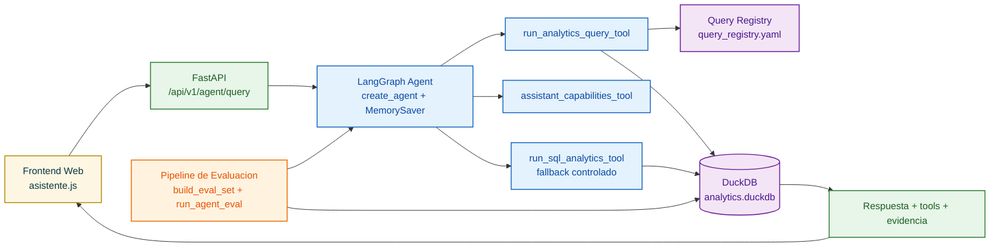
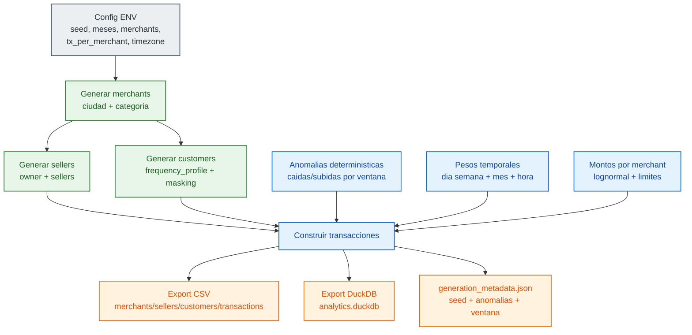
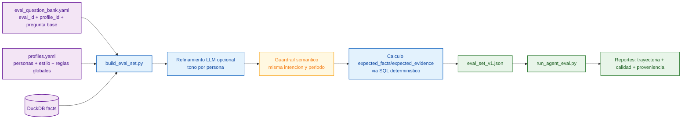

# hackDeUna

Backend MVP de asistente analitico para microcomercios. El proyecto combina datos sinteticos, evaluacion automatica y un agente conversacional con herramientas SQL seguras.

## Idea Principal

El flujo completo es:

1. Construir dataset sintetico reproducible.
2. Construir set de evaluacion con preguntas realistas y expectativas numericas exactas.
3. Refinar redaccion de preguntas usando perfiles de usuario.
4. Ejecutar evaluacion automatica rigurosa (local y LangSmith).
5. Exponer API para frontend con respuestas del agente ancladas a SQL y evidencia.

## Pilares Fundamentales

### 1) Construccion del Dataset

- Se genera un dataset sintetico de comercios, transacciones, clientes y vendedores.
- Se materializa en CSV + DuckDB para consultas analiticas reproducibles.
- El objetivo es que cada corrida pueda validarse y regenerarse sin dependencia manual.

Como se acerca a condiciones reales de uso:

- Reproducibilidad fuerte por semilla: el dataset usa `DATASET_SEED` para poder regenerar exactamente los mismos escenarios.
- Diversidad de comercios: se simulan multiples merchants con ciudad y categoria, no un solo negocio homogeneo.
- Estructura operativa realista: cada comercio tiene 1 a 3 vendedores (owner + sellers) con pesos de participacion distintos.
- Clientes con comportamiento heterogeneo: perfiles `loyal`, `occasional` y `one_time` con probabilidades de recurrencia diferentes.
- Estacionalidad diaria/semanal: pesos por dia de semana y por mes para reproducir demanda variable.
- Patron horario de caja: transacciones concentradas en horas comerciales (manana, mediodia, tarde, noche) con distribucion no uniforme.
- Montos plausibles por comercio: importes por transaccion via distribucion lognormal y limites (cap/floor) para evitar valores absurdos.
- Anomalias controladas: se inyectan ventanas deterministicas de caida/subida para probar deteccion de tendencias y comparativas.
- Privacidad desde origen: documentos/cuentas se guardan en formato enmascarado.
- Trazabilidad: se escribe metadata de generacion (semilla, ventana temporal, anomalias) para auditoria del benchmark.

Tablas resultantes:

- `merchants`
- `sellers`
- `customers`
- `transactions`

Comandos clave:

```bash
make dataset-build
make dataset-validate
```

### 2) Perfiles Para Refinar Preguntas

- El set de evaluacion parte de un banco de preguntas base.
- Cada pregunta puede refinarse con contexto de perfil (tono, estilo, necesidad).
- El refinamiento mejora lenguaje real sin romper las expectativas factuales.

Como funciona la capa de personas:

- Banco base: `src/agent/semantics/eval_question_bank.yaml` define `eval_id`, `profile_id` y pregunta base.
- Perfiles: `src/agent/semantics/profiles.yaml` define contexto del negocio, objetivo y notas de estilo para cada persona.
- Personas actuales:
	- `rosa`: foco en ingresos diarios y dias buenos/malos, lenguaje muy simple.
	- `miguel`: foco en vendedores y clientes frecuentes, tono practico.
	- `daniela`: foco en retorno de clientes y tendencias simples.
	- `carlos`: foco en caidas de ingreso y recomendaciones accionables.
- Reglas globales de lenguaje: espanol local (`es-EC`), tono cercano y exclusion de jerga tecnica.
- Guardrail semantico en refinamiento: la pregunta puede cambiar de forma, pero no de intencion analitica ni periodo temporal.
- Resultado: evaluaciones mas parecidas al lenguaje real de usuarios finales, manteniendo comparabilidad tecnica en los expected facts.

Comando clave:

```bash
make evals-build
```

### 3) Evaluacion Rigurosa

- Evaluacion automatica del agente con criterios objetivos.
- Mide tres dimensiones centrales:
	- trayectoria de herramientas
	- calidad de respuesta
	- proveniencia/evidencia de consulta
- Se ejecuta localmente y tambien en LangSmith para trazabilidad de experimentos.

Comandos clave:

```bash
make evals-agent
make evals-agent-fast
make evals-agent-langsmith
```

Reportes:

- Se guardan en `data/evals/reports/`.

### 4) Agente Con SQL Seguro

- El runtime conversacional usa LangGraph + tools.
- La herramienta principal para negocio es `run_analytics_query_tool`.
- La ejecucion SQL usa guardrails (solo consultas seguras, sin operaciones destructivas).
- Las capacidades soportadas se gestionan por registro de queries habilitadas.
- Hay fallback controlado para consultas fuera de cobertura estricta, respetando seguridad.

### 5) API Para Frontend

- Se expone endpoint simple para integracion rapida de UI.
- Se mantiene endpoint detallado para debug y pruebas internas.
- CORS configurable para ambientes web locales.

## Arquitectura (Resumen)

- API FastAPI: `src/server/api/app.py`
- Runtime agente LangGraph: `src/server/langgraph_agent/graph.py`
- Tools del agente: `src/server/langgraph_agent/tools.py`
- Servicio deterministico y SQL: `src/server/assistant/service.py`
- Guardrails SQL y fallback text-to-SQL: `src/server/assistant/text2sql.py`
- Registro de queries: `src/agent/semantics/query_registry.yaml`
- Perfiles: `src/agent/semantics/profiles.yaml`
- Build de eval set: `src/agent/evals/build_eval_set.py`
- Runner de evaluacion: `src/agent/evals/run_agent_eval.py`

## Correr La API Local

```bash
uv sync --extra dev
make api-dev
```

Servidor local:

- `http://localhost:8000`

Nota:

- `make api-dev` carga automaticamente variables desde `.env`.

## Endpoints

### Endpoint Simple (Frontend)

- Metodo: `POST`
- Path: `/api/v1/agent/query`
- Body:
	- `question` (requerido)
	- `thread_id` (opcional)

Ejemplo curl:

```bash
curl -X POST "http://localhost:8000/api/v1/agent/query" \
	-H "Content-Type: application/json" \
	-d '{
		"question": "¿Cuánto vendí esta semana?",
		"thread_id": "frontend-smoke-1"
	}'
```

Respuesta esperada (forma):

```json
{
	"answer": "...",
	"tools": ["run_analytics_query_tool"]
}
```

### Transcripcion De Voz En Frontend (Experimental)

Estado actual:

- Se agrego una transcripcion por voz rapida en `HTML/asistente.html` + `js/asistente.js`.
- Funciona solo del lado del navegador (no sube audio al backend).
- Usa Web Speech API (`webkitSpeechRecognition`) y esta pensada para pruebas rapidas en Chrome.

Comportamiento actual:

- El usuario presiona el boton de microfono.
- El texto se transcribe en vivo en el input.
- Al terminar la escucha, se envia automaticamente como pregunta al endpoint del agente.

Advertencia importante:

- Esto es un experimento de baja complejidad, hecho para validar UX en muy poco tiempo.
- No es una implementacion lista para produccion.

Limitaciones conocidas:

- Cobertura de navegadores limitada (objetivo principal: Chrome).
- Sensible a permisos de microfono y condiciones del dispositivo.
- Dependencia de timeouts/comportamiento del motor de reconocimiento del navegador.
- Sin capa robusta de reintentos, observabilidad avanzada o control fino de sesiones de audio.

Trabajo pendiente para una version robusta:

- Mejor manejo de errores y estados de red/permisos.
- Estrategia cross-browser real.
- Telemetria de calidad de transcripcion.
- Opcional: pipeline de STT backend para consistencia fuera del navegador.

### Endpoint Detallado (Interno)

- Metodo: `POST`
- Path: `/assistant/agent-query`
- Body:
	- `question_es` (requerido)
	- `thread_id` (opcional)

Ejemplo curl:

```bash
curl -X POST "http://localhost:8000/assistant/agent-query" \
	-H "Content-Type: application/json" \
	-d '{
		"question_es": "¿Cómo me fue esta semana en comparación con la anterior?",
		"thread_id": "agent-debug-1"
	}'
```

### Endpoint Deterministico

- Metodo: `POST`
- Path: `/assistant/query`
- Uso: pruebas de pipeline deterministico sin runtime conversacional.

## Memoria Conversacional (Multiturno)

- El agente usa un checkpointer en memoria para mantener contexto por `thread_id`.
- Es memoria temporal en proceso:
	- funciona mientras el proceso este vivo
	- se pierde al reiniciar el servidor
	- no se comparte entre replicas

## Variables De Entorno Clave

- Runtime API: `DEUNA_MERCHANT_ID`, `APP_TIMEZONE`, `APP_CURRENCY`
- CORS: `API_CORS_ALLOW_ORIGINS`
- Modelo agente: `AGENT_MODEL`, `AGENT_TEMPERATURE`, `AGENT_TIMEOUT_SECONDS`
- Planner de registro: `AGENT_PLANNER_MODEL`, `AGENT_PLANNER_MIN_CONFIDENCE`
- Registro de queries: `QUERY_REGISTRY_PATH`
- Fallback controlado: `AUTO_GUARDED_SQL_FALLBACK`, `ENABLE_TEXT2SQL_FALLBACK`
- Evaluacion/preguntas: `PROFILES_PATH`, `REFINE_QUESTIONS_WITH_LLM`
- Proveedores: `OPENAI_API_KEY`, `LANGSMITH_API_KEY`, `LANGSMITH_PROJECT`

## Flujo Recomendado De Trabajo

```bash
make dataset-build
make dataset-validate
make evals-build
make evals-agent
make api-dev
```

Con este flujo, frontend y backend trabajan sobre una base coherente: datos reproducibles, preguntas refinadas por perfil, evaluacion automatica y respuestas del agente trazables por SQL.

## Diagramas (Mermaid)

### 1) Arquitectura General Del Modelo



### 2) Generacion Del Dataset Transaccional



### 3) Creacion De Preguntas De Evaluacion

